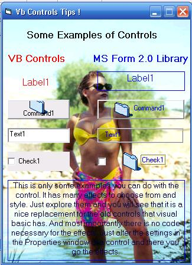



## VB Controls Tip

### Description

For all Beginners and advance users out there!. I've got a nice tip for you. VB Programmers must know this tip co'z it affects speed in our program especially those building large programs.And Also I have found a nice replacement for Vb Controls and they have lots of features with like Transparency and Picture Stuff.I know Advance users already know this but just for the sake of those who do not know.Look at the screen shot.Anyway enjoy tip inside.Have a nice day !
 
### More Info
 

             |
---                |---
**Submitted On**   |2005-11-20 12:46:28
**By**             |[Mark Anthony Dinglasa](https://github.com/Planet-Source-Code/PSCIndex/blob/master/ByAuthor/mark-anthony-dinglasa.md)
**Level**          |Beginner
**User Rating**    |4.5 (18 globes from 4 users)
**Compatibility**  |VB 6\.0
**Category**       |[Custom Controls/ Forms/  Menus](https://github.com/Planet-Source-Code/PSCIndex/blob/master/ByCategory/custom-controls-forms-menus__1-4.md)
**World**          |[Visual Basic](https://github.com/Planet-Source-Code/PSCIndex/blob/master/ByWorld/visual-basic.md)
**Archive File**   |[VB\_Control19514311272005\.zip](https://github.com/Planet-Source-Code/mark-anthony-dinglasa-vb-controls-tip__1-63391/archive/master.zip)

